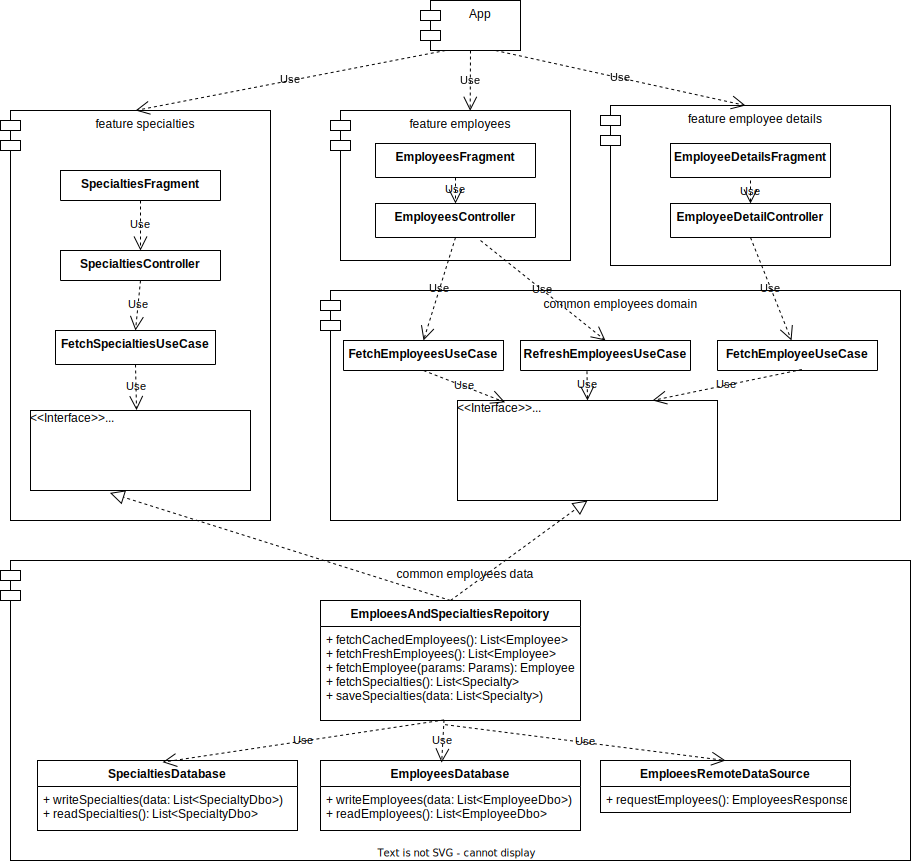

# MyEmployeesTestTask

### Development plan (estimation/real)
0000. Check out TS (1h/1h)
0001. UML-diagram (1h/2h)
0002. MVI - research (1h/1h)
0003. Request employees (1h/1h)
0004. Request employees test (1h/30m)
0005. Save to Db (4h/5h) + tests
0006. Offline-first logic (1h/2h 30m)
0007. Fetch specialties, employees, employee use cases (1h/1h) + tests
0008. Handle date logic (1h/30m)
0009. Handle date test (1h/30m)
0010. Handle name and surname logic (1h/30m)
0011. Handle name and surname test (1h/30m)
0012. UI specialties (2h/3h)
0013. UI employees (2h/3h)
0014. UI employees details (2h/1h)

Estimation: 21h /Real: 24h

 + Extra tasks:
0014. Progress and error state - 2h

### MVI research results:
1. [MVI Core Badoo](https://github.com/badoo/MVICore) need's a little but more time
2. [MVI Kotlin](https://github.com/arkivanov/MVIKotlin) look's more easy

### UML diagram

